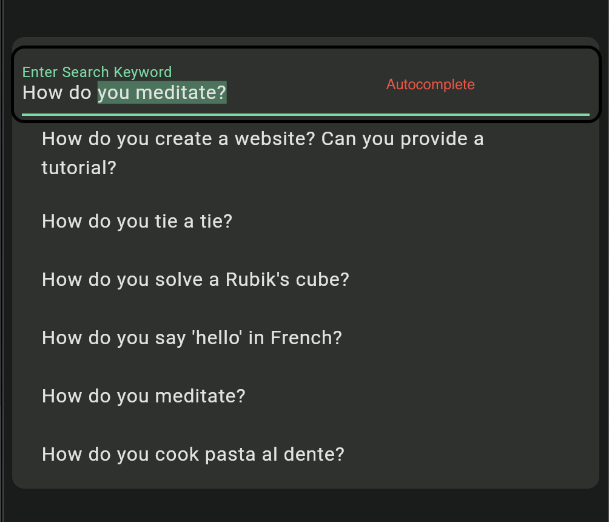
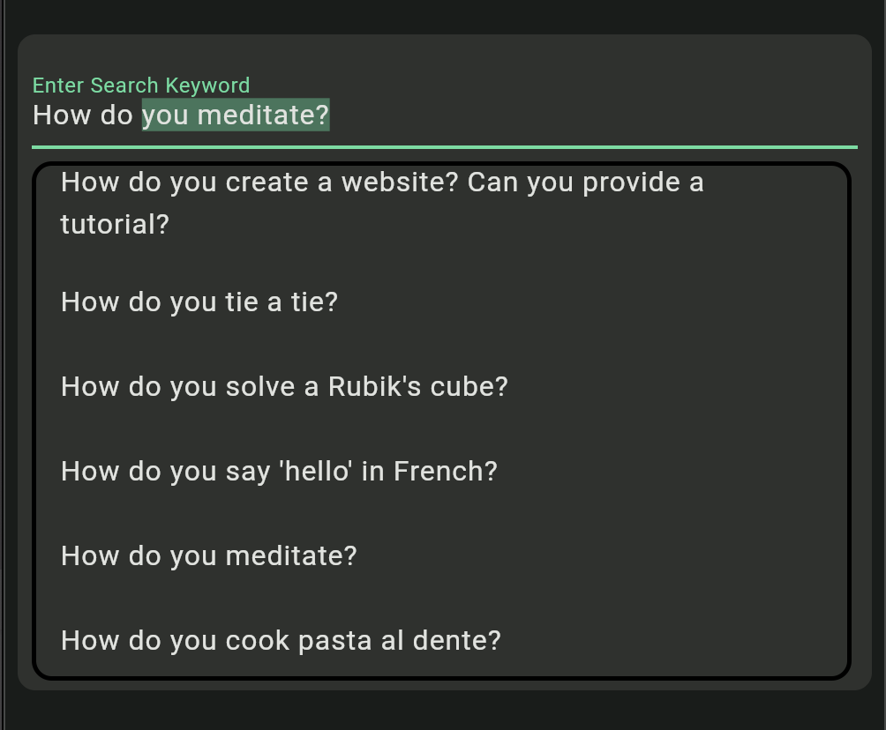

# Smart Autocomplete

Smart Autocomplete is a Flutter package designed to provide intelligent autocomplete functionality to text input fields in your Flutter applications. With Smart Autocomplete, users can enjoy a seamless typing experience as the widget suggests and completes text based on provided suggestions.


## Demo
Visit here for demo

## Features

- **Customizable**: Smart Autocomplete offers various customization options to tailor the autocomplete behavior and appearance according to your application's needs.
- **Async Support**: Fetch suggestions asynchronously from a data source, ensuring smooth performance even with large datasets.
- **Error Handling**: Handle errors gracefully with customizable error messages or widgets.
- **Loading Indicators**: Display loading indicators while fetching suggestions asynchronously to provide feedback to users.
- **Rich Suggestions**: Render suggestions in a customizable widget, enabling rich UI experiences for users.


Then, run `flutter pub get` to install the package.

## Usage

```dart
import 'package:flutter/material.dart';
import 'package:smart_autocomplete/smart_autocomplete.dart';

void main() {
  runApp(const MyApp());
}

class MyApp extends StatelessWidget {
  const MyApp({super.key});

  // This widget is the root of your application.
  @override
  Widget build(BuildContext context) {
    return MaterialApp(
      title: 'Smart AutoComplete Demo',
      darkTheme: ThemeData(
        colorScheme: ColorScheme.fromSeed(
            seedColor: Colors.greenAccent, brightness: Brightness.dark),
        useMaterial3: true,
      ),
      theme: ThemeData(
        colorScheme: ColorScheme.fromSeed(
            seedColor: Colors.greenAccent, brightness: Brightness.light),
        useMaterial3: true,
      ),
      home: const MyHomePage(title: 'Smart Auto Complete'),
    );
  }
}

class MyHomePage extends StatefulWidget {
  const MyHomePage({super.key, required this.title});

  final String title;

  @override
  State<MyHomePage> createState() => _MyHomePageState();
}

class _MyHomePageState extends State<MyHomePage> {
  final TextEditingController controller = TextEditingController();

  Future<List<String>> getSuggestions(String key) async {
    await Future.delayed(const Duration(milliseconds: 500));
    return chromeHistory.where((e) => e.toLowerCase().startsWith(key)).toList();
  }

  Future<String?> getAutoCompletion(String text) async {
    if (text.isEmpty) {
      return null;
    }
    await Future.delayed(const Duration(milliseconds: 500));
    var input = text.toLowerCase();
    var sortedOptions = chromeHistory
        .where((option) => option.toLowerCase().startsWith(input))
        .toList();
    sortedOptions.sort((a, b) => a.length.compareTo(b.length));

    if (sortedOptions.isNotEmpty) {
      var completion = sortedOptions.first;
      return completion;
    } else {
      return null;
    }
  }

  bool showSuggestions =
      true; // Add a flag to control whether to show suggestions

  @override
  Widget build(BuildContext context) {
    return Scaffold(
      appBar: AppBar(
        backgroundColor: Theme.of(context).colorScheme.inversePrimary,
        title: Text(widget.title),
      ),
      body: Center(
        child: Padding(
          padding: const EdgeInsets.all(8.0),
          child: Column(
            mainAxisAlignment: MainAxisAlignment.center,
            children: <Widget>[
              Container(
                padding: const EdgeInsets.all(8.00),
                decoration: BoxDecoration(
                  borderRadius:
                      BorderRadius.circular(10.0), // Adjust the value as needed
                  color: Theme.of(context)
                      .colorScheme
                      .onInverseSurface, // Adjust color as needed
                ),
                child: SmartAutoCompleteWidget<String>(
                    controller: controller,
                    loadingWidgetBuilder: () => showSuggestions
                        ? const SizedBox(
                            height: 50,
                            child: Row(
                              mainAxisAlignment: MainAxisAlignment.center,
                              children: [
                                CircularProgressIndicator(),
                              ],
                            ))
                        : const SizedBox.shrink(),
                    suggestionsBuilder: (context, data) {
                      if (!showSuggestions || data.isEmpty) {
                        return const SizedBox.shrink();
                      } else {
                        return LimitedBox(
                          maxHeight: 300,
                          child: ListView.builder(
                            shrinkWrap: true,
                            itemCount: data.length,
                            itemBuilder: (context, index) {
                              final item = data[index];
                              return ListTile(
                                title: Text(item),
                                onTap: () {
                                  controller.text = item;
                                  setState(() {
                                    showSuggestions = false;
                                  });
                                },
                              );
                            },
                          ),
                        );
                      }
                    },
                    getSuggestions: getSuggestions,
                    onChanged: (f) {
                      setState(() {
                        showSuggestions = true;
                      });
                    },
                    getAutocompletion: getAutoCompletion),
              )
            ],
          ),
        ),
      ),
      // This trailing comma makes auto-formatting nicer for build methods.
    );
  }
}

  List<String> chromeHistory = [
    "Where is the Tower of Giza?",
    "What are the steps to bake chocolate chip cookies?",
    "How do you create a website? Can you provide a tutorial?",
  ];

```

## Documentation

### Autocomplete
 

### Suggestions



- **loadingWidgetBuilder**: `Widget Function()`  
  A builder function used to construct a widget to display while data for suggestions is being fetched asynchronously. If not provided, a default circular progress indicator is displayed.  
  Example:
  ```dart
  loadingWidgetBuilder: () {
    return Center(
      child: CircularProgressIndicator(),
    );
  },
  ```


- **errorBuilder**: `Widget Function(BuildContext context, Object error)`  
  A builder function used to construct a widget to display when an error occurs while fetching data for suggestions. If not provided, a default error message is displayed.  
  Example:
  ```dart
  errorBuilder: (context, error) {
    return Text('An error occurred: $error');
  },
  ```

- **suggestionsBuilder**: `Widget Function(BuildContext context, List<T> data)`  
  A builder function used to construct widgets based on the list of suggestions obtained from the `getSuggestions` callback.  
  Example:
  ```dart
  suggestionsBuilder: (context, suggestions) {
    return ListView.builder(
      itemCount: suggestions.length,
      itemBuilder: (context, index) {
        return ListTile(
          title: Text(suggestions[index]),
          onTap: () {
            // Handle selection logic
          },
        );
      },
    );
  },
  ```

- **getSuggestions**: `GetSuggestionsCallback<T>`  
  A callback function used to fetch suggestions based on a provided keyword or query from the textfield.  
  Example:
  ```dart
  getSuggestions: (String keyword) async {
    // Implement logic to fetch suggestions from a data source
    return ['apple','apricot','avocado'];
  },
  ```

- **getAutocompletion**: `GetAutocompletionCallback<String>`  
  A callback function used to fetch autocompletion for a given input text.  
  Example:
  ```dart
  getAutocompletion: (String inputText)async {
    // Suppose User has written inside textfield 'W'
    // then you can give recommendation like
    return 'What is Ram Mandir?'
  },
  ```
  - `Null` is returned when there is no match
  - `String` is returned when there is a match


| Feature     | getAutocompletion                                         | getSuggestions                                             |
| ----------- | --------------------------------------------------------- | ---------------------------------------------------------- |
| Usage       | Fetch autocompletion for text typed inside the textfield. | Provide options or suggestions based on user input.        |
| Return Type | `Future<String?>`                                         | `Future<List<T>>`                                          |
| Invocation  | Invoked as the user types inside the textfield.           | Triggered when the suggestionBuilder widget requests data. |
